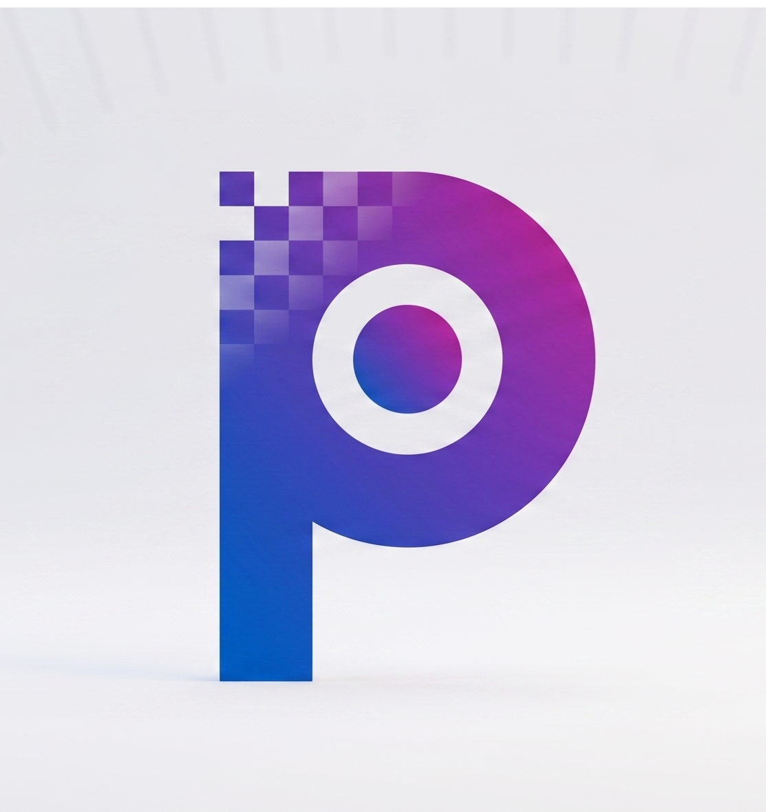

# PixelGo

<div align="center">
  
  <p><b>A zero-server, peer-to-peer file transfer application.</b></p>
  
  [](https://nextjs.org/)
  [](https://www.typescriptlang.org/)
  [](https://webrtc.org/)
  [](https://opensource.org/licenses/MIT)
  
  **[Live Demo](https://pixelgo.tech)** • **[Report Bug](https://github.com/harishchalla-cloud/pixelgo/issues)** 
</div>

---

## Overview

PixelGo is a browser-based file transfer application built to route data directly between devices without intermediate server storage. 

By utilizing WebRTC DataChannels and the Web Crypto API, the application establishes a direct, end-to-end encrypted socket connection between peers. This architecture circumvents file size constraints, eliminates data retention risks, and removes the need for user authentication protocols.

## Core Features

* **End-to-End Encryption:** Payloads are encrypted locally on the client machine using AES-256-GCM prior to network transmission.
* **Streaming Architecture:** The transfer engine reads and encrypts files slice-by-slice. This memory-efficient pipeline prevents RAM overflow and browser crashes when handling large payloads (e.g., 10GB+).
* **Optical Handshake Protocol:** Connection parameters and public keys are exchanged out-of-band via a dynamically generated QR code, mitigating man-in-the-middle (MITM) risks during the initial peer discovery phase.
* **Network Backpressure Management:** The application monitors receiver buffer capacity (`RTCDataChannel.bufferedAmount`), dynamically throttling the upload stream to prevent UDP packet loss over high-latency or unstable networks.

## System Architecture & Data Flow

PixelGo manages network traversal and memory constraints through the following lifecycle:

1. **Session Key Generation**: The sender generates an ephemeral 256-bit AES-GCM key locally via `window.crypto.subtle`.
2. **Out-of-Band Handshake**: Session descriptions (SDP), ICE candidates, and cryptographic keys are encoded into a QR payload.
3. **P2P Signaling**: Devices negotiate a WebRTC connection via a signaling server (PeerJS). If direct NAT traversal fails, it falls back to a TURN relay.
4. **Encrypted Transport**: The source file is chunked into 64KB ArrayBuffers to optimize for SCTP limits, encrypted, and streamed.
5. **Flow Control**: The sender actively monitors the data channel buffer, pausing transmission to align with the receiver's network throughput.
6. **Reassembly**: The receiver sequentially decrypts incoming ArrayBuffers, triggers a native OS blob download, and flushes memory to accept subsequent chunks.

## Tech Stack

* **Frontend Framework:** Next.js (App Router), React, TypeScript
* **Networking:** WebRTC (RTCDataChannel), PeerJS
* **Cryptography:** Native Web Crypto API
* **UI/Styling:** Tailwind CSS, Lucide React
* **Client-Side Processing:** HTML5 Canvas, `jsQR`

## Local Development

To run the application locally, ensure you have Node.js installed, then execute the following commands in your terminal:

```bash
git clone [https://github.com/harishchalla-cloud/pixelgo.git](https://github.com/harishchalla-cloud/pixelgo.git)
cd pixelgo
npm install
npm run dev